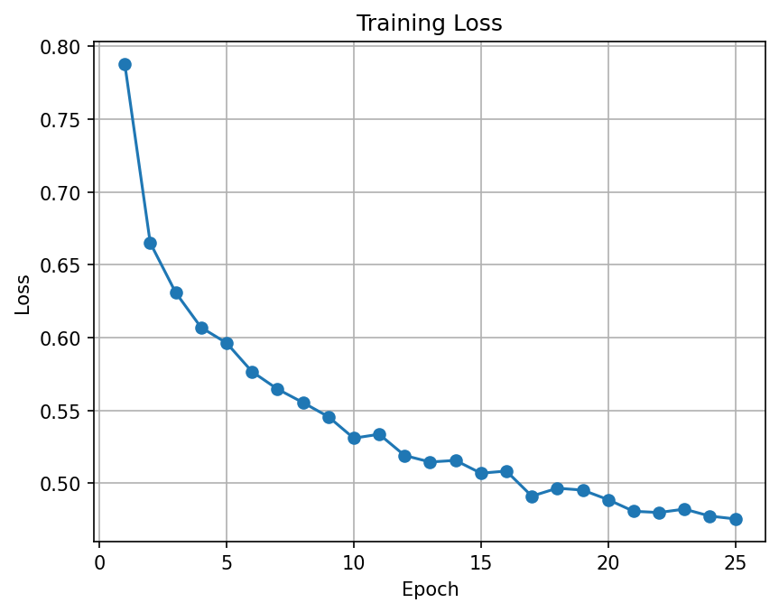
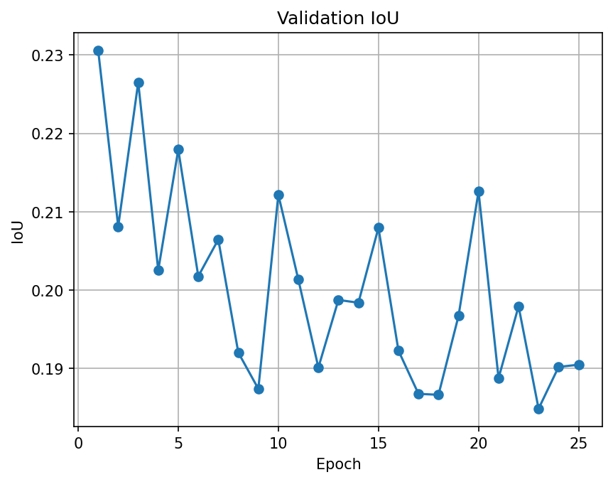

# <Paper title>

This readme file is an outcome of the [CENG7880 (Fall 2025)](https://metu-trai.github.io/) project for reproducing a paper which does not have an implementation. See [CENG501 (Spring 2021) Project List](https://github.com/metu-trai/Projects2025) for a complete list of all paper reproduction projects.

# 1. Introduction
Few-shot learning tries to segment the unlabeled novel category with very few labeled samples. However, most of the existing FSS methods fail in cases where support and query images contain extremely different backgrounds, resulting in misaligned foreground features and low segmentation performance.

This is addressed by an iterative approach introduced in the paper. The process iteratively refines segmentation predictions, enhances alignment of support and query features, and minimizes the negative effect of conflicting background information. The method reaches state-of-the-art performance on benchmark PASCAL-5i and COCO-20i datasets, demonstrating significant amelioration over existing few-shot segmentation methods.

## 1.1. Paper summary

The paper highlights the overlooked problem of background context bias in few-shot segmentation and introduces an iterative refinement structure that strengthens the consistency of support and query foreground representations. By repeatedly updating feature guidance and eliminating accumulated noise, the method yields significantly improved segmentation performance.

The key contributions are:

- Introducing an iterative framework to align support and query foreground features more effectively.
- Achieving state-of-the-art performance on widely used FSS benchmarks.

---

# 2. The method and my interpretation

## 2.1. The original method

The paper presents an iterative few-shot segmentation framework that refines the guidance extracted from support images over multiple iterations. Each iteration is composed of three components:

1. **Query Prediction QP**  
2. **Support Modulation SM**  
3. **Information Cleansing IC**

All components use the same backbone to create the feature maps \(f_s\) and \(f_q\) based on the support image \(I_s\) and the query image \(I_q\). The detailed network architecture is shown and explained below:

### 2.1.1. Query Prediction

The Query Prediction module generates a segmentation mask for the query image using a foreground guidance feature from the support image.  

Let the support and query feature maps be \( f_s \) and \( f_q \in \mathbb{R}^{C \times H' \times W'} \).  
The downsampled foreground mask for the support image is \( G_s \).  

Using \( G_s \), the method selects the foreground positions in \( f_s \), treats the corresponding feature vectors as tokens, and collects them into a foreground feature set \( S_{\text{QP}}^{1} \) for the first iteration.

At iteration \( t \), the guidance feature set \( S_{\text{QP}}^{t} \) is used in conjunction with the query feature map \( f_q \) to predict the query mask. Specifically, the prediction logits \( P^{t} \) are obtained as
\[
P^{t} = \phi_p\left(
  \operatorname{CAT}\left(
    \operatorname{AVG}\left(S_{\text{QP}}^{t}\right),
    f_q
  \right)
\right),
\]
where \( \operatorname{AVG}(\cdot) \) denotes the average over all tokens in \( S_{\text{QP}}^{t} \), and \( \operatorname{CAT}(\cdot) \) denotes concatenation along the channel dimension. The mapping \( \phi_p \) is instantiated as two successive \( 1 \times 1 \) convolutional layers that transform the concatenated features into the prediction logits \( P^{t} \).

For subsequent iterations, the guidance feature set is updated using the output of the Information Cleansing module, according to
\[
S_{\text{QP}}^{t} \leftarrow S_{\text{IC}}^{t-1}, \quad t = 2 \to T.
\]

Conceptually, the module acts as a prototype-based predictor: at each iteration, it uses a prototype computed from the support set to generate the query segmentation mask, then refines this prototype through the Information Cleansing step before reusing it in the next iteration.

### 2.1.2. Support Modulation

The Support Modulation step is designed to reduce the mismatch between support and query foreground features that arises from differences in background. The main idea is to extract a **query evolution feature** that describes how the query foreground changes from an input-level representation to the deep backbone representation, and then to use this information to adjust the support foreground feature so that it becomes more consistent with the query.

The evolution feature is split into two parts. The pixel-wise evolution feature \(E_p\) describes how each individual foreground pixel changes between a context-independent representation at the input and a context-influenced representation at the backbone output. The structure-wise evolution feature \(E_s\) summarizes how pairwise relationships or affinities among foreground pixels change between input and output, using histogram-based statistics to capture these structural shifts.

These two terms are then combined as

\[
E = E_p + E_s,
\]

where \(E_s\) is broadcast to all foreground tokens and added to \(E_p\), so that each token carries both pixel-level and structure-level evolution information.

On the query side, the method forms a set of background tokens \(B\) from features at locations that are currently predicted as background, based on the prediction \(P^t\). A cross-attention operation then uses \(B\) as queries and the evolution feature \(E\) as keys and values to compute a context representation \(C\)

\[
C = \text{ATT}(Q_B, K_E, V_E),
\]

where ATT denotes a standard query–key–value attention block.

Finally, the support feature is modulated using this context. The model attends from the current guidance \(S_{\text{QP}}^{t}\) to the context \(C\) and adds the result back to the guidance:

\[
S_{\text{SM}}^{t} = S_{\text{QP}}^{t} + \text{ATT}\big(Q_{S_{\text{QP}}^{t}}, K_C, V_C\big).
\]

The resulting feature \(S_{\text{SM}}^{t}\) is a query-aware support representation that is intended to be better aligned with the query foreground than the original \(S_{\text{QP}}^{t}\).

### 2.1.3. Information Cleansing

Because Support Modulation depends on the current prediction \(P^t\), errors in this prediction can introduce noise into the modulated guidance \(S_{\text{SM}}^{t}\). The Information Cleansing step aims to reduce such noise using a confidence-biased attention mechanism.

The process starts by computing a second prediction \(\hat{P}^{t}\). This is done by running the same Query Prediction step again, but now using the modulated feature \(S_{\text{SM}}^{t}\) instead of the original guidance \(S_{\text{QP}}^{t}\). From both \(P^t\) and \(\hat{P}^t\), the method derives entropy-based confidence maps, denoted by \(C\) and \(\hat{C}\). It then measures how the confidence changes by forming

\[
V = \hat{C} - C,
\]

which highlights pixels where the confidence has decreased.

The map \(V\) is injected into an attention module that attends from a feature built from the pair \([S_{\text{QP}}^{t}, S_{\text{SM}}^{t}]\) to the query features \(f_q\):

\[
N = \text{softmax}\big(Q_{\phi[S_{\text{QP}}^{t}, S_{\text{SM}}^{t}]} K_{f_q} + V\big)\, V_{f_q}.
\]

Here, the term \(V\) biases the attention weights so that regions with lower confidence receive more attention. A linear layer \(\phi\) then maps \(N\) into the same feature space as \(S_{\text{SM}}^{t}\), and the cleaned guidance feature is obtained by subtracting this correction:

\[
S_{\text{IC}}^{t} = S_{\text{SM}}^{t} - \phi(N).
\]

The feature \(S_{\text{IC}}^{t}\) is passed forward as the new guidance \(S_{\text{QP}}^{t+1}\) in the next iteration, which closes the loop of the three-stage recurrent design.

---

## 2.2. My interpretation 

- **Data preprocessing.** Exact resize, normalization, and augmentation types are not mentioned.  
- **Attention type.** Single- vs multi-head and head settings are unclear.  
- **Binary mask threshold.** How to turn probabilities into foreground/background masks is not defined.  
- **Channel sizes.** Some hidden and feature channel dimensions are not specified.  

These points need experimenting for finding exact implementation details, will be  this part later.

# 3. Experiments and results

## 3.1 Experimental setup

All experiments use the ABCB model described in Section 2. We used the ResNet-50 backbone initialized with ImageNet-pretrained weights and **feeze the model** throughout training (backbone parameters have `requires_grad=False`; BatchNorm layers are held in **eval** mode). Backbone features are projected to a **256-dimensional** embedding space and used **T = 3** for iterative updates. Attention blocks is **4 headed**, the structure-history resolution is set to **L_hist = 16**, and we cap the number of tokens to control memory and runtime: **max_support_tokens = 1024**, **max_fg_tokens = 512**, and **max_bg_tokens = 512**. Query Prediction, Support Modulation, Evolution Features (pixel-wise and structure-wise), and Information Cleansing are instantiated exactly as in our provided implementation.

Training and evaluation are conducted on **PASCAL-5ᵢ (fold 2)** using the project’s episodic reader (`Pascal5iReader(base_dir, fold=2, train=True/False)`), which yields **1-shot** episodes consisting of one support image/mask pair and one query image/mask pair. To accommodate variable spatial sizes returned by the reader, data loading uses a custom `collate_fn` that **pads** all tensors in a minibatch to the maximum height/width in that batch, after which the training pipeline applies the same spatial preprocessing to all frames. Inputs are normalized using ImageNet mean/std. During training, episodes are augmented with **random scaling** in ([0.5, 2.0]), **horizontal flipping** with probability 0.5, and a **random crop** to **473×473**. Validation uses the same normalization but **disables stochastic augmentation**.

Hyperparameters used for training is same as used in the paper: SGD with **momentum 0.9** and **weight decay 1e-4**, a base learning rate of **2×10⁻³**, and a **polynomial decay** schedule with power **0.9** applied over the full training acraoss epochs (`epochs × len(train_loader)` iterations),  **batch_size = 16**, **num_workers = 4**, **λ = 0.2** for the auxiliary loss weight, and **crop_size = 473**. For faster iteration during debugging, we occasionally train on a reduced subset of episodes; final numbers should be reported using the full episodic sampler. Model is evaluated with mean IoU on the held-out fold-2 classes, computed from the model’s interpolated logits using our binary IoU routine.

At this stage, our implementation targets **PASCAL-5ᵢ 1-shot** only. Extensions to **COCO-20ᵢ**, **5-shot** episodic training, and alternative backbones (e.g., ResNet-101) are left for future work, along with running all four folds and reporting the standard cross-validated average.

## 3.2 Running the code

All experiments in this project can be reproduced by running the notebook  **`temp.ipynb`**, which contains the full pipeline for dataset construction, model initialization, training, and evaluation. At the current stage, the notebook serves as the primary entry point for executing the code and verifying results.

In future revisions, this notebook workflow will be refactored into a standalone package , enabling more general and modular use beyond the notebook environment.

## 3.3 Results

This section summarizes the currently available result figures:

*  the baseline PASCAL-5ᵢ results reported in the paper (included for reference).

*  the training loss curve produced by the current implementation.

*  the validation IoU curve produced by the current implementation.

At this point, the training loss steadily decreases, suggesting the model is learning and the optimization is behaving as expected. However, the run is still at an early stage, and the limited number of training epochs has not been sufficient to achieve strong segmentation performance, so the validation IoU remains near zero.

# 4. Conclusion

Discuss the paper in relation to the results in the paper and your results.

# 5. References

Provide your references here.

# Contact

Provide your names & email addresses and any other info with which people can contact you.
